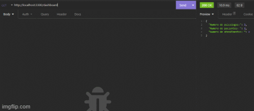

# la-vie

    <a href="#sobre">Sobre</a> ☺ 
    <a href="#tecnologias">Tecnologias</a> ☺ 
    <a href="#funcionalidades">Funcionalidades</a> ☺ 
    <a href="#autores">Autores</a> ☺ 
    <a href="#site">Site</a>

### Sobre

    O La Vie consiste em uma API que nos permite criar registro de Psicólogos, Pacientes e Atendimentos, assim como
    editá-los , listá-los e excluí-los.

### Tecnologias

[JAVASCRIPT] 
[MYSQL] 
[INSOMNIA] 

### Funcionalidades

- [x] Realizar cadastros de psicólogos, pacientes e atendimentos.
- [x] Editar cadastrosd e psicólogos, pacientes e atendimentos.
- [x] Excluir cadastros de psicólogos, pacientes e atendimentos.
- [x] Listar cadastros de psicólogos, pacientes e atendimentos.
- [x] Listar quantidade de psicólogos, pacientes e atendimentos.

### Autores

<a href="https://github.com/tarikraposo">
  
 <b>Tarik Raposo</b>
</a> 
 
<a href="https://github.com/Tiagokochem">
  
 <b>Tiago Kochem</b>
</a> 

<a href="https://github.com/EvanilsonP">
  
 <b>Evanilson P.</b>
</a> 

### Site

<h4 style="margin-bottom: 30px; margin-top: 30px;"> # </h4>

### GIF

